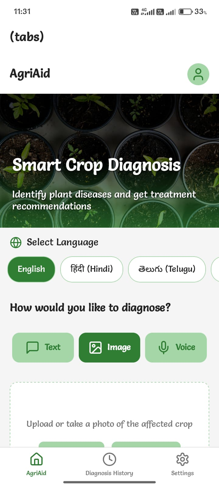
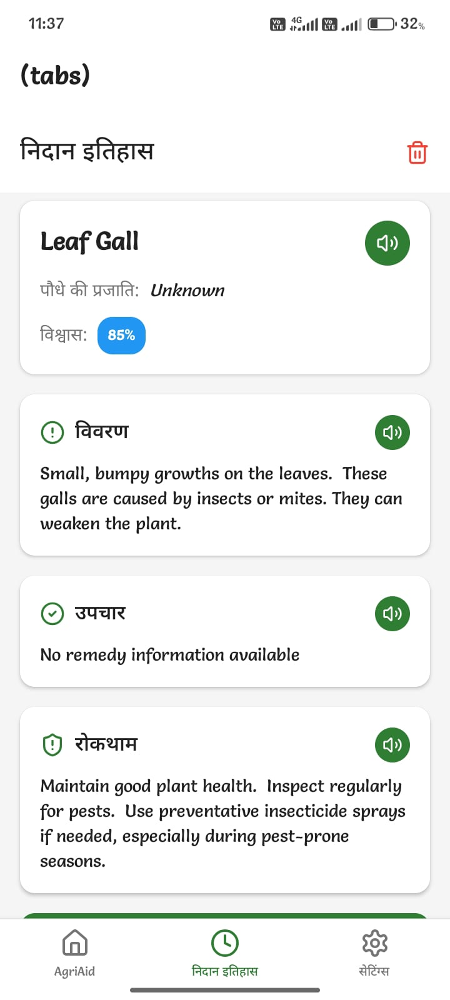
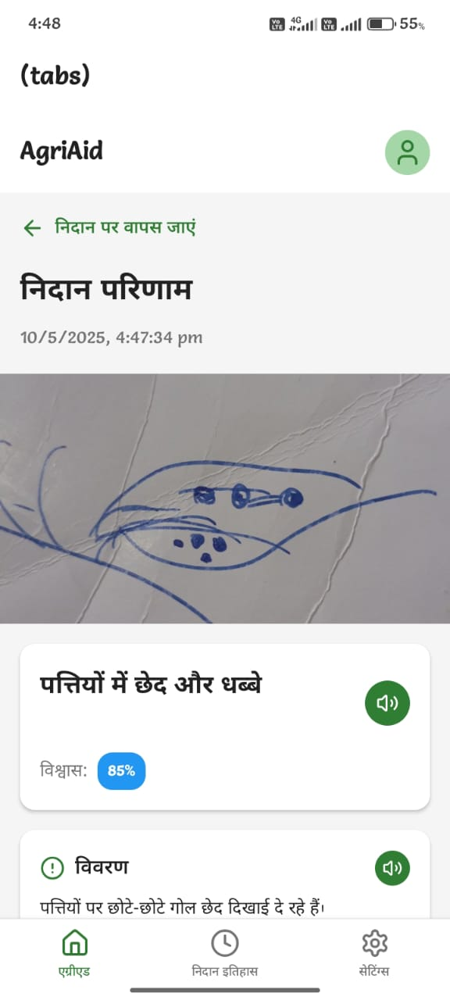
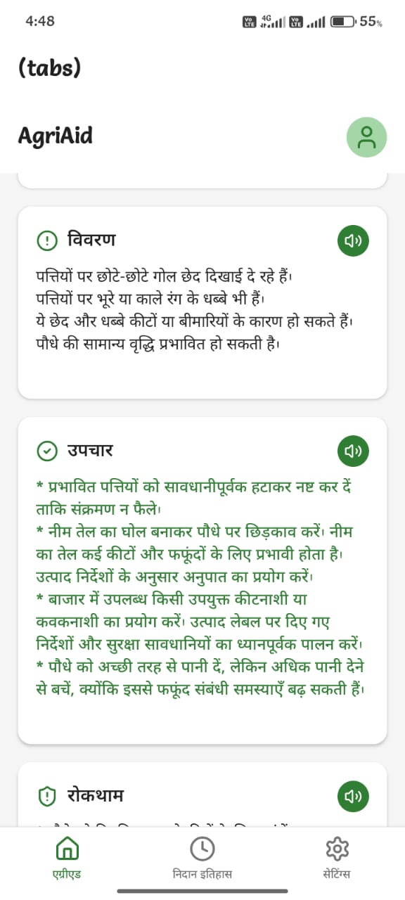
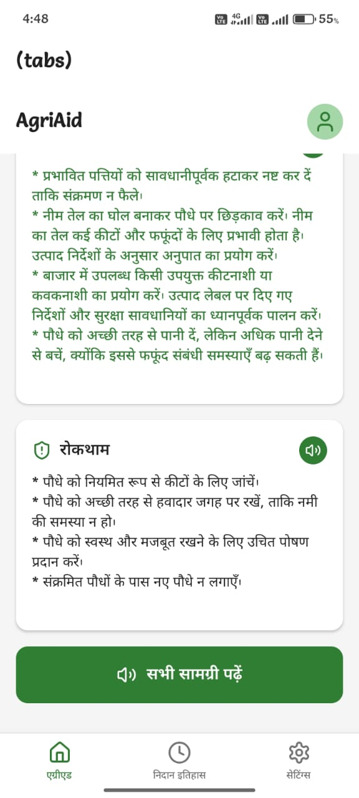

<h1> AgriAid </h1>

AgriAid is an AI-powered agricultural assistant designed to detect plant diseases and provide farmers with real-time, actionable insights.
Built for inclusivity and accessibility, AgriAid supports text, image, and voice inputs, making it usable even in rural areas with low literacy or limited technical exposure.

Introduction

AgriAid leverages machine learning models trained on diverse crop datasets and integrates Gemini API for smart predictions.
The system is designed to be scalable and runs across multiple devices, ensuring it reaches the maximum number of users.

<h2> Key Features </h2>

Multimodal Input: Diagnose crops through text, image, or voice.

Multilingual & Voice Output: Communicates in users’ native languages for wider accessibility.

AI-Based Detection: Identifies plant diseases in real time using trained ML models.

Inclusive Design: Simple and intuitive UI suitable for users with low literacy levels.

Offline-Ready: Functions in low-connectivity areas with local processing.

<h2> Why It Matters? </h2> 

Faster diagnosis leads to reduced crop loss.

Empowers farmers with accessible, localized technology.

Brings AI for all – no technical skills required.

Supports sustainable agriculture through precision solutions.

<h2> 🛠️ Prerequisites</h2> 

Node.js (LTS version recommended)

Expo Go app installed on your mobile (Android/iOS)

Gemini API Key (for AI responses)

RapidAPI Key (for speech-to-text and translation services)

<h2> ⚙️ Setup Instructions </h2> 

1. Clone the Repository

git clone https://github.com/tulsikumar18/AgriAid.git

cd AgriAid

2. (Optional) Activate Virtual Environment

If using a Python environment for backend scripts, activate it:

Mac/Linux

source myenv/bin/activate

Windows (PowerShell)

myenv\Scripts\Activate.ps1

3. Install Dependencies (If not done ,Already done here in  Myenv)

npm install

4. Configure API Keys

Update the following files with your keys:

utils/geminiApi.ts → Add your Gemini 1.5 Flash API key

utils/speechToText.ts → Set RAPID_API_KEY

utils/translate.ts → Set RAPID_API_KEY

5. Run the Application

npm run start

This will start the Expo development server.

6. Preview the App

Scan the QR code from the terminal/browser using the Expo Go app on your mobile device.

The application will open in Expo Go.

<h2> ## 📸 Demo</h2> 

## Screenshots

  
  

  
  
  

